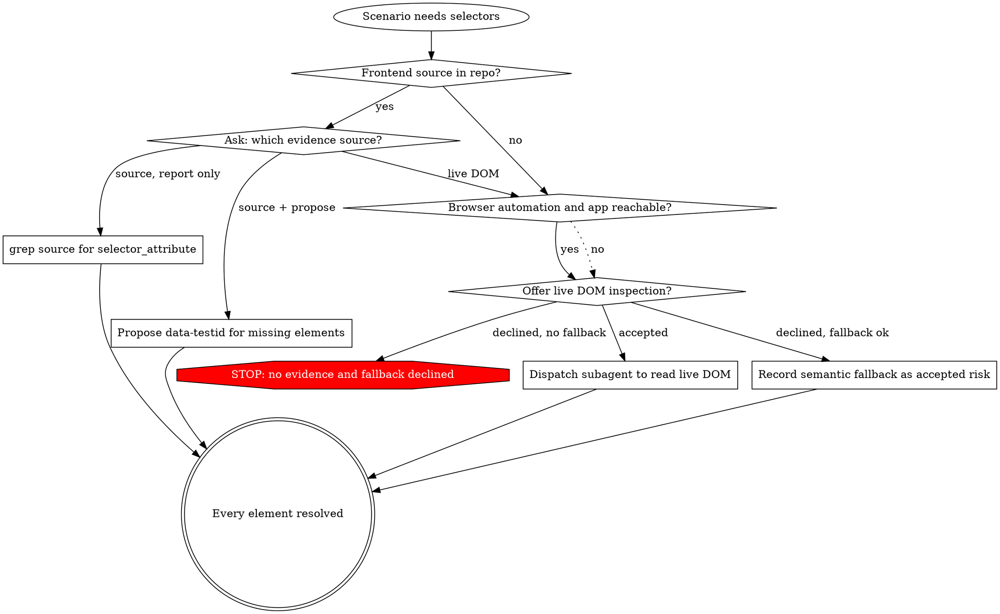
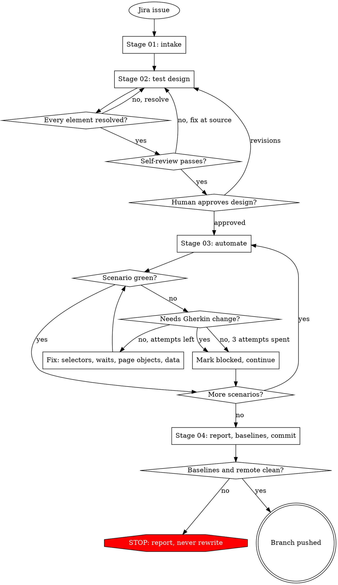
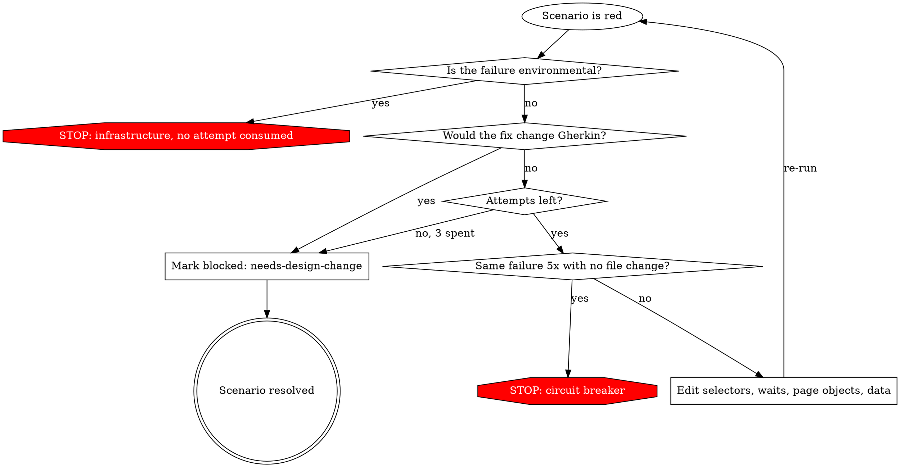

# speckit-qa-auto — QA & Automation Test Delivery Pipeline

Date: 2026-08-19
Status: approved (design), not yet implemented
Scope: new skill `speckit-qa-auto/`; additive change to `jira-to-speckit/` (version `0.2.0 → 0.3.0`); new row in `README.md`; new `test-case/speckit-qa-auto/`

## Problem

No skill in this repository delivers QA work. A tester starting from a Jira story today does all
of the following by hand, in two disconnected halves:

1. Read the story, derive test scenarios, write manual test cases into Xray.
2. Later, separately, write Playwright BDD `.feature` files that restate the same scenarios in
   Gherkin, then step definitions, page objects, and selectors.

Four defects follow.

1. **The same test is authored twice.** A manual test case in Xray and a `.feature` scenario
   express the same behaviour in two artifacts with no link between them. They drift, and nobody
   can tell which one is current.
2. **Selectors are discovered too late.** Element selectors are found while writing step
   definitions — after the scenario is already written. When a selector does not exist in the
   frontend, the work is already committed to a shape that cannot be automated.
3. **Existing Xray coverage is invisible during design.** New test cases are designed without
   reading what is already covered, so duplicates are created and stale tests are left unrevised.
4. **QA conventions are trapped in one repo.** The reference repository
   (`om-mom-e2e-playwright`) encodes its conventions in repo-local skills — `mom-auto-testing`,
   `mom-manual-testing`, `e2e-testing` — plus a `workflows/e2e-test-development.md` pipeline
   description. None of it is reusable, and the pipeline description is prose, not an executable
   skill.

## Design Decisions

Recorded here because several were user overrides of the first proposal.

| # | Decision | Rationale |
|---|---|---|
| D1 | A **standalone skill** with its own lifecycle, rather than a QA mode bolted onto an existing delivery skill | QA changes must not force a version bump on a skill that other teams already depend on |
| D2 | **Full chain in v1**: Jira → analysis → design → Gherkin → automation → run | The Gherkin file is the single artifact for both halves, so splitting v1 would not reduce work |
| D3 | **No spec-framework provider layer** — no provider config file, no provider adapters, no constitution or bootstrap gate | A provider layer exists to select a *product-spec* framework. Authoring automation tests does not use one |
| D4 | **Playwright-BDD + TypeScript is assumed.** No abstraction over other test frameworks | User directive. Removes a layer of indirection that has no second consumer today |
| D5 | Repo conventions come from a **repo-local playbook**, discovered — not from a new config file | The reference repo already has one (`mom-auto-testing`). Shared skill owns *process*; repo owns *convention* |
| D6 | **No Xray write in the pipeline.** Import runs in CI when the PR merges | User directive. Keeps `jira-to-speckit` a pure reader (see D7) |
| D7 | Xray lives **inside `jira-to-speckit`**, not in a separate skill | User directive. Feasible without breaking its contract precisely because of D6 — read-only stays read-only |
| D8 | **`docs/qa/<key>/` is the source of truth** for `.feature`; Stage 03 copies into the test tree | User directive. One authored version, one derived version, one direction of flow |
| D9 | Fix loop **may not edit Gherkin** | Without this the pipeline makes tests green by weakening them. See §6.2 |
| D10 | **No submodule leak-guard machinery.** At most one submodule (frontend), read-only by default | User directive. Ordered multi-submodule commit guarding has no second consumer here |
| D11 | The workspace guard is **content-aware**, not `git status` string comparison | User defect report. A status string cannot distinguish "already dirty" from "dirty and then modified again". See §7.1 |
| D12 | Repo profile discovery runs **before** the worktree gate, and the frontend submodule gets **its own baseline** | Review round 2. Frontend init was conditioned on a field produced by a later step, and the source-checkout baseline cannot see inside a submodule. See §4 steps 1-5 |
| D13 | Xray discovery is a **fixed JQL**, and dedup matches on **scenario name normalization**, not judgement | Review round 2. Two runs over the same story must produce the same labels. See §1.1, §5.1 |
| D14 | Non-Cucumber Xray tests are fetched **separately** and dedup against them is declared `advisory` | Review round 2. `export/cucumber` silently returns nothing for Manual tests, which is what most existing coverage is. See §1.1 |
| D15 | CI imports Xray from **`docs/qa/`**, never from the test tree | Review round 2. The test tree omits blocked scenarios, so importing from it would drop approved test cases. See §6.3, §10 |
| D16 | The **push is fast-forward only**; a diverged remote stops the run instead of rebasing | Review round 2. A rebase after verification reports a green result for a tree that was never run. See §7 step 4 |
| D17 | Every scenario carries a **surface** — `ui`, `api`, or `manual` — and the selector gate binds only to `ui` | Review round 2. A manual-only or API scenario has no elements to resolve; the gate would block a valid design. See Constraint 3 |
| D18 | The profile cache holds **only human answers**, with source provenance hashes for everything derived | Review round 2. A cache that is committed and read first becomes config; a stale playbook would apply silently. See §2 |
| D19 | Selector resolution is a **user choice among evidence sources**, not a single hard-coded path | Review round 3. Frontend source is one way to get evidence; a live DOM is another. The gate binds to *evidence*, not to grep. See Constraint 3 |
| D20 | Live DOM inspection runs in a **subagent** | Review round 3. A DOM dump is large and single-use; only the selector map needs to reach the main context |
| D21 | Process flow is expressed in **graphviz at decision points and loops only** | Review round 3. Linear steps are numbered lists. A diagram of a straight line teaches nothing and costs tokens. See §11.1 |
| D22 | Reference files are **loosely coupled**: stages hand off through run state on disk, never by requiring each other's prose | Review round 3. A file that only makes sense after reading two others cannot be revised, tested, or loaded on its own. See §11.2 |

## Constraint 1: The Gherkin File Is The Only Test Artifact

One `.feature` file serves three consumers:

| Consumer | Reads it as |
|---|---|
| Manual tester | The test case — Given/When/Then steps to execute by hand |
| `playwright-bdd` | The spec that `bddgen` compiles into Playwright tests |
| Xray (via CI on merge) | A Cucumber Test issue, created or updated in place |

Nothing is authored twice, and there is no translation step between formats.

## Constraint 2: Xray Speaks Gherkin In Both Directions

Verified against Xray Cloud documentation (`docs.getxray.app`, fetched 2026-08-19):

| Direction | Endpoint |
|---|---|
| Authenticate | `POST https://xray.cloud.getxray.app/api/v2/authenticate` — body `{"client_id":…,"client_secret":…}`, returns a bearer token |
| Read existing tests | `GET  https://xray.cloud.getxray.app/api/v1/export/cucumber?keys=A;B` — returns a zip of `.feature` files |
| Write tests (CI only) | `POST https://xray.cloud.getxray.app/api/v2/import/feature?projectKey=<KEY>` — multipart `file=@features.zip` |

No MCP server is required; `curl` is sufficient, which keeps the skill portable across GitHub
Copilot, Claude Code, and OpenCode — the same approach `jira-to-speckit` already takes with the
Jira REST API.

Xray binds issues to Gherkin through tags:

| Tag | Level | Meaning |
|---|---|---|
| `@REQ_<STORY-KEY>` | Feature | Links every test in the file to the story as its requirement |
| `@TEST_<TEST-KEY>` | Scenario | Binds the scenario to an existing Test issue — import **updates in place** instead of creating a duplicate |

These are **additive**. The reference repo's existing tags (`@Automation`, `@Regression_Test`,
`@MOM-3776`, domain tags) stay exactly as they are, so `--grep` filtering and the current CI
workflow are unaffected.

## Constraint 3: Selectors Must Resolve Before Gherkin Is Approved

The reference repo already proves this step
(`.github/skills/brainstorming/references/selector-verification.md`): derive the UI elements each
scenario touches, grep the frontend source for `data-testid`, and produce a selector map where
every element resolves to one of three states — existing testid, proposed testid (with the exact
file and line to add it), or semantic fallback (role/label/text).

This design promotes it from a sub-flow to a **hard gate on Stage 02**. The gate binds to
**evidence**, not to one technique (D19): every element of every UI scenario must resolve against
something real before Gherkin is approved. Guessed selectors are the dominant cause of red tests,
and every red test costs a fix iteration.

There are three evidence sources, and which one applies is a **user choice presented at the gate**
— the same shape as a design-section approval, not a silent branch:

| Source | Available when | Produces |
|---|---|---|
| **Repository source** | `frontend_source_root` resolves to a readable tree | `grep` for `selector_attribute`; existing testid, or a proposed one with file and line |
| **Live DOM** | The host exposes browser automation **and** the app is reachable | Real attributes read from the running application (D20 — in a subagent) |
| **Semantic fallback** | Always | `role` / label / text strategy, recorded as an accepted risk |



**The choice is asked, never assumed.** When frontend source is present the user still picks:
report-only, propose-testids, or go to the live DOM anyway — a stale checkout makes source the
wrong evidence, and only the user knows that.

**Live DOM inspection runs in a subagent (D20).** The subagent receives the element list and the
application URL, drives the host's browser automation, and returns **only the selector map**. A DOM
dump is large, single-use, and would crowd out the design context for no benefit. It reads; it
never interacts destructively and never submits forms.

Prerequisites for the live option, from the repo profile and `.env`: an application base URL and,
when the app requires it, credentials. Missing either → the option is not offered, because a login
wall returns a selector map for the login page and nothing else.

**Semantic fallback is a recorded risk, not a free pass.** Choosing it writes
`selector_evidence: fallback` plus the user's acknowledgement into `test-design.md`, and the Stage
04 report repeats it. Fallback-derived selectors are the likeliest to consume Stage 03 fix
iterations; saying so up front is the point.

**`--yolo` has a fixed order and never invents evidence**: repository source if readable, else live
DOM if available, else **stop**. It does not choose fallback on the user's behalf.

**The gate binds to UI scenarios only (D17).** Step 2.3 assigns every scenario a `surface`:

| `surface` | Meaning | Selector gate | Stage 03 |
|---|---|---|---|
| `ui` | Drives the application through its interface | **Applies.** Every element resolves, or the run stops | Automated |
| `api` | Exercises an endpoint or a service contract, no interface | Does not apply. The scenario must instead name its endpoint and request/response fixture | Automated |
| `manual` | Cannot or should not be automated — visual judgement, external system, physical device | Does not apply | Not automated; lives in the artifact only |

A scenario with `surface: ui` and zero UI elements is a design error, not a pass. A scenario with
`surface: manual` needs an explicit one-line reason recorded beside it; without the reason the
self-review gate (2.7) fails, because `manual` is otherwise an easy way to make the selector gate
disappear.

`--yolo` may not assign `surface` on its own where the classification is genuinely ambiguous; an
ambiguous scenario is the one case `--yolo` asks.

## Pipeline Flow

Gates and loops only — the steps inside each stage are numbered lists in §4 to §7, not diagrams
(D21).



Stage 03 is the only region with no human edge: once entered, it runs to a scenario verdict or to
the circuit breaker (§6.5). Every loop in it is bounded — 3 fix attempts per scenario, 5 identical
failures overall.

## 1. Skill Inventory

| Skill | State | Owns |
|---|---|---|
| `speckit-qa-auto` | new, initial version `0.1.0` | The four-stage QA pipeline. Contains no repository-specific convention |
| `jira-to-speckit` | modified, `0.2.0 → 0.3.0` | Adds an optional `xray-read` mode. Remains a pure reader |

### 1.1 `jira-to-speckit` change

A new optional input `xray_tests` (default `false`). When true, after the existing brief is
produced:

1. Resolve `XRAY_CLIENT_ID` / `XRAY_CLIENT_SECRET` from `.env`. Absent → report `xray: unavailable`
   and continue; this is a warning, never a stop, because the brief is still valid without it.
2. **Discover the covering tests with one fixed JQL** (D13), so two runs over the same story return
   the same set:

   ```
   issue in testRequirement("<STORY-KEY>") ORDER BY key ASC
   ```

   `testRequirement` is the Xray-provided JQL function for "tests that cover this requirement" —
   the same relationship the `@REQ_` tag creates on import. When the Xray JQL functions are not
   available on the instance, fall back to a single documented query and record which one ran:

   ```
   issuetype = Test AND issue in linkedIssues("<STORY-KEY>") ORDER BY key ASC
   ```

   Never merge the two result sets, and never add heuristics such as label or summary matching. The
   query that ran is reported as `xray_query: testRequirement | linkedIssues`.

3. **Split the result by test type**, because the two travel differently:
   - **Cucumber tests** → `GET /api/v1/export/cucumber?keys=…`, unzip, concatenate into
     `xray_output_path`.
   - **Every other type** (Manual, Generic) → **`export/cucumber` returns nothing for these** (D14).
     Fetch them through the Jira REST API instead — key, summary, labels, and, when Xray Cloud
     GraphQL credentials are present, their steps — and write them to `xray_manual_output_path` as
     a markdown table.

   Both files are optional and named by the caller. Whichever is not requested is not written.

4. Report per file: how many tests, which query ran, and — critically — whether the non-Cucumber
   set could be fetched. A caller that receives Cucumber tests but no Manual tests is looking at
   partial coverage and must be told so, not left to assume the story has none.

Contract change, stated precisely: the skill now writes **at most three files**, all named by the
caller — `ticket_output_path`, `xray_output_path`, `xray_manual_output_path`. It still performs no
write to any remote system, runs no pipeline stage, and performs no git operation. Existing callers
that omit `xray_tests` observe the `0.2.0` behaviour unchanged.

## 2. Repo Profile Discovery

`speckit-qa-auto` carries no knowledge of any repository. Stage 01 resolves a **repo profile** by
searching, stopping at the first source that answers:

1. A repo-local automation skill — `.github/skills/*auto-testing*/SKILL.md`, `.claude/skills/*/SKILL.md`
2. `AGENTS.md` / `CLAUDE.md`
3. `docs/` guideline files
4. Inference — `package.json` scripts, `playwright.config.ts`, and one existing
   `.feature` / `.steps.ts` pair read as a worked example

Fields resolved:

| Field | Example (reference repo) |
|---|---|
| `test_root` | `src/tests` |
| `feature_path` | `src/tests/{domain}/{domain}-{aspect}.feature` |
| `steps_path` | `src/tests/{domain}/{domain}-{aspect}.steps.ts` |
| `page_path` | `src/pages/{domain}/{DomainAspect}Page.ts` |
| `selectors_path` | `src/pages/{domain}/{DomainAspect}Selectors.ts` |
| `testdata_path` | `src/support/{domain}/fixtures/{name}.json` |
| `generate_cmd` | `npm run bddgen` |
| `scoped_run_cmd` | `npm run test:headed -- --grep "<tag>" --project chromium` |
| `frontend_source_root` | `om-mom-frontend` (submodule) |
| `selector_attribute` | `data-testid` |
| `existing_tags` | `@Automation`, `@Regression_Test`, `@{Domain}` |
| `xray_project_key` | `MOM` |
| `branch_prefix` | `test/` |
| `artifact_root` | `docs/qa` |

### 2.1 What is cached, and what is not (D18)

A file that is committed and read before discovery stops being a cache and becomes configuration —
and configuration that nobody remembers authoring is worse than no configuration, because a
playbook can change its conventions while the file keeps applying the old ones. A "do the paths
still exist?" check does not catch that: the paths still exist, they are simply no longer the
convention.

The file is therefore split by *who can answer*:

```json
// docs/qa/.repo-profile.json
{
  "answers": {
    "xray_project_key":     "MOM",
    "frontend_source_root": "om-mom-frontend"
  },
  "provenance": {
    "sources": [
      {"path": ".github/skills/mom-auto-testing/SKILL.md", "sha256": "…"},
      {"path": "package.json",                            "sha256": "…"}
    ]
  }
}
```

- **`answers`** holds only what discovery cannot derive from any file — the questions a human had
  to answer. These persist.
- **Everything else in the §2 table is re-derived from the playbook on every run.** It is never
  stored. The playbook stays the single source of truth for convention.
- **`provenance`** records every file discovery read, with its content hash. On each run the hashes
  are recomputed. Any mismatch means the playbook changed: re-derive, and report which source
  changed. This is what makes staleness visible instead of silent.
- A field in `answers` whose value no longer resolves — a `frontend_source_root` that is not a
  directory, an `xray_project_key` Xray rejects — is asked again, not reused.

## 3. Artifact Layout

```
docs/qa/
├── .repo-profile.json                 discovery cache, shared by every ticket
└── <jira-key>-<slug>/
    ├── ticket.md                      Jira snapshot (from jira-to-speckit)
    ├── existing-tests.feature         Cucumber tests exported from Xray — read-only reference
    ├── existing-tests-manual.md       Manual/Generic Xray tests — advisory only (§5.1)
    ├── <domain>-<aspect>.feature      AUTHORED HERE — source of truth (D8)
    ├── test-design.md                 analysis, coverage matrix, selector map, plan
    └── execution-report.md            run state, per-scenario status, blockers
```

The test tree (`src/tests/…`) holds a **derived copy** of the `.feature`, materialized in Stage 03.

### 3.1 Anti-drift rule

The materialized copy is a **scenario-level subset** of the artifact version. Subset yes;
modification never. Because a subset is not a textual match, the check is Gherkin-aware, not a text
diff:

| Element | Rule |
|---|---|
| `Feature:` name, feature-level tags, `Background:` | Must be **identical** in both files. These are never subset, never edited |
| Each `Scenario` / `Scenario Outline` | Present in the copy → its name, tags, step sequence, and `Examples` table must match the artifact version exactly. Absent from the copy → allowed only when §6.3 marked it blocked |
| Scenario order | Follows the artifact version. Reordering is a modification |
| A scenario in the copy that is absent from the artifact | Always a violation. Nothing is authored in the test tree |

Two degenerate cases, stated so they are not improvised:

- **Every scenario in a file is blocked** → the file is **not materialized at all**, and any
  previously materialized copy is deleted. An empty `Feature:` block is not a valid artifact.
- **A `Scenario Outline` with some rows blocked** → the whole outline is blocked. Example rows are
  not individually omitted; splitting an `Examples` table would change the scenario.

Stage 03 re-checks this on entry and rebuilds the copy from the artifact when they differ.

## 4. Stage 01 — Intake

No human gate. Ends by entering Stage 02 in the same turn.

```
repo profile (read-only) → source baseline → worktree + branch → frontend init + FE baseline
→ Jira intake → Xray existing tests → artifact folder init → Stage 02
```

The order matters and was wrong in the first draft (D12): frontend initialization is conditioned on
`frontend_source_root`, which repo profile discovery produces. Discovery therefore runs first. It
only reads, so it is safe to run against the source checkout before any worktree exists.

1. **Repo profile** — §2. Read-only against the source checkout. May ask its one round of
   questions here, before anything has been created. The `answers` file is *written* later, in the
   worktree, at step 6.
2. **Source checkout baseline** — capture `workspace_baseline` (§7.1) now, before the run touches
   anything. Capturing it later would bake in changes the run itself caused.
3. **Worktree gate.** Base branch priority `develop → main → master` (local, then remote-tracking),
   best-effort sync, linked worktree at `<repo-root>/.worktrees/<branch>`, `.worktrees/`
   git-ignored. Branch name `<branch_prefix><jira-key>-<slug>`, resolved after intake and renamed
   in place with `git branch -m` when a provisional name was used.
4. **Frontend source initialization is a hard requirement, not best-effort.** When
   `frontend_source_root` names a submodule, `git submodule update --init -- <path>` **inside the
   worktree** must succeed. It is a stop, not a warning: Stage 02's selector gate reads frontend
   source, and an empty submodule directory makes that gate unsatisfiable. Failure stops the run
   with the git error quoted.

   No general multi-submodule handling exists (D10). The pipeline expects at most one submodule,
   the frontend, and treats it as **read-only** — Stage 02's selector gate is report-only, and
   approved frontend edits go to a separate frontend branch, never to the test branch.

5. **Frontend baseline (D12).** The read-only status above needs its own enforcement. The §7.1
   source-checkout baseline does **not** provide it, for two reasons: the frontend is initialized
   inside the *worktree*, not the source checkout; and a parent repository's `git diff HEAD` sees a
   submodule only as a gitlink — a commit pointer — so edits to files inside it are invisible to
   it. Immediately after step 4, capture a second content-addressed baseline, scoped to the
   frontend working tree:

   ```
   frontend_baseline:
     path:                  <worktree>/<frontend_source_root>
     head_sha:              git -C <path> rev-parse HEAD
     worktree_diff_sha256:  sha256( git -C <path> diff --binary HEAD )
     index_diff_sha256:     sha256( git -C <path> diff --cached --binary HEAD )
     untracked:             [ {path, size, sha256}, ... ]
   ```

   Stage 04 re-computes it. Any difference is a violation **unless** the run recorded an explicit
   user approval for frontend edits at step 2.4, in which case the diff is reported for review
   instead. This is what makes "the frontend is read-only" a checked property rather than an
   intention.
6. **Jira intake** — `jira-to-speckit`, default mode, writing `ticket.md`.
7. **Xray existing tests** — `jira-to-speckit` with `xray_tests: true`, writing
   `existing-tests.feature` and `existing-tests-manual.md`. Unavailable credentials degrade to a
   warning; Stage 02 then records every behaviour as `NEW` and marks dedup `not-run` (§5.1).
8. **Resume.** An existing `<jira-key>-*` artifact folder is reused, never duplicated with a new
   slug. `execution-report.md` names the stage to resume from.

## 5. Stage 02 — Test Design ◀ HUMAN GATE

| Step | Action |
|---|---|
| 2.1 | **Requirement analysis** — acceptance criteria to a list of testable behaviours. A blocking ambiguity is asked **once**; a non-blocking one is recorded under Open Questions and the run continues |
| 2.2 | **Dedup against Xray** — §5.1. Every behaviour labelled `NEW`, `UPDATE <TEST-key>`, `SKIP (covered by <TEST-key>)`, or `REVIEW <TEST-key>` |
| 2.3 | **Scenario design** — Gherkin, one behaviour per scenario, negative and boundary cases included. Every scenario assigned a `surface` (`ui` / `api` / `manual`, see Constraint 3). Coverage matrix: acceptance criterion → scenarios |
| 2.4 | **Selector gate (hard)** — §Constraint 3, applied to `surface: ui` scenarios only. The evidence source is **asked**, not assumed: repository source, live DOM via subagent, or recorded semantic fallback. Frontend edits require explicit approval, are recorded in run state for the §4 step 5 frontend baseline, and land on a separate frontend branch inside the submodule, never mixed into the test branch |
| 2.5 | **Write `.feature`** into `docs/qa/<key>/`. Tags: `@REQ_<story>` at Feature level; `@TEST_<key>` at Scenario level only for `UPDATE` rows; plus the profile's `existing_tags` |
| 2.6 | **Write `test-design.md`** — scenarios, coverage matrix, selector map, page objects to create or modify, test data and mock plan, dedup decisions, open questions |
| 2.7 | **Self-review gate** — every acceptance criterion covered · no `TODO`/`TBD`/placeholder · every element of every `surface: ui` scenario resolved in the selector map · every `surface: api` scenario naming its endpoint and fixture · every `surface: manual` scenario carrying a reason · every behaviour carrying a dedup label. Fix at source and re-verify. The same check failing 3 consecutive times stops the run |
| 2.8 | **Human gate** — present the summary, take approval or revisions, commit the artifacts, take the single start-automation confirmation, enter Stage 03 in the same turn |

`--yolo` skips 2.8 but **not** 2.4 and **not** 2.7.

### 5.1 Dedup is a rule, not a judgement (D13)

Two runs over the same story must produce the same labels, so matching is defined mechanically.

**Normalized scenario key** — lowercase; strip tags, leading `Scenario:` / `Scenario Outline:`,
punctuation, and collapsed whitespace; strip quoted literals and numbers so parameter values do not
split otherwise-identical scenarios.

| Condition | Label |
|---|---|
| Key matches an exported Cucumber scenario, step sequence identical | `SKIP (covered by <TEST-key>)` |
| Key matches, step sequence differs | `UPDATE <TEST-key>` — carries `@TEST_<key>`, import updates in place |
| No key match anywhere | `NEW` |
| An existing test's key matches nothing in the new design | `REVIEW <TEST-key>` — reported at the human gate, never deleted or modified by the pipeline |

**Non-Cucumber tests are advisory (D14).** Manual and Generic tests arrive as
`existing-tests-manual.md` — a table, not Gherkin — so no key match is possible against them. They
are presented at the 2.8 human gate as *possible overlap, decide yourself*, and they never produce
an automatic `SKIP`. Silently treating a Manual test as uncovered would create duplicates; silently
treating it as covered would drop coverage. Neither is acceptable, so a human decides.

**When Xray was unavailable** (§4 step 7), every behaviour is `NEW` and `test-design.md` records
`dedup: not-run` with the reason. An unrun dedup must never be indistinguishable from one that ran
and found nothing.

## 6. Stage 03 — Automate ◀ NO-STOP ZONE

| Step | Action |
|---|---|
| 3.0 | **Materialize** — copy `.feature` from the artifact folder to `feature_path`. On any difference the artifact wins; the copy is overwritten and the overwrite is logged |
| 3.1 | **Partition** — work one scenario package at a time, in dependency order. Pass each package only the slices it needs; never forward whole prior-stage prose |
| 3.2 | **Generate** — `*.steps.ts`, `*Page.ts`, `*Selectors.ts`, fixtures and mocks, following the repo profile. Only selectors present in the approved selector map may be used |
| 3.3 | **Verify** — `generate_cmd`, then `scoped_run_cmd` filtered to the scenario's tag. Capture the output |
| 3.4 | **Fix loop** — at most 3 attempts per scenario (§6.2) |
| 3.5 | **Coverage review loop** — once scenarios are green: every acceptance criterion has at least one passing scenario · every selector map entry is used · repo conventions hold (page objects via `BasePage`, selectors centralized, no hardcoded test data in steps, no `waitForTimeout`). A failure feeds the next fix iteration, never a stop |

### 6.1 Scope of the test run

Default: only the affected domain's tests plus the new scenarios. A full-suite run is the explicit
`--full-suite` flag, because a full suite is slow and is rarely what a single ticket needs.

### 6.2 Fix loop rules

**Permitted edits:** selectors, waits and synchronization, page objects, step definitions, test
data, mocks.

**Forbidden, without exception:**

- editing any `.feature` file — the artifact version or the materialized copy
- weakening, removing, or commenting out an assertion
- adding `waitForTimeout`
- adding `.skip`, `@fixme`, or any tag whose effect is to stop the scenario running
- narrowing `scoped_run_cmd` so a red scenario is no longer selected



These exist because a fix loop with write access to its own success criteria will make every test
pass and prove nothing.

### Red Flags in the fix loop — thoughts that mean STOP

| Thought | Reality |
|---|---|
| "This assertion is too strict for the real app" | The assertion was approved at Stage 02. Mark blocked; do not relax it |
| "A short `waitForTimeout` is the pragmatic fix here" | It is the flake you will chase next sprint. Use an explicit wait condition |
| "Just tag it `@fixme` so the suite is green" | A green suite that skips the scenario is a false report |
| "The Gherkin has a typo, one word will not hurt" | Any Gherkin edit reopens the Stage 02 gate. One word included |
| "Narrow the grep so this scenario is out of scope" | Changing what runs to change the result is the same defect as changing the assertion |
| "It failed the same way 5 times but I will try once more" | That is the circuit breaker. Report the stuck state |

### 6.3 Blocked scenarios

When passing a scenario would require changing its Gherkin, the scenario is not fixed. It is marked
`blocked: needs-design-change` in `execution-report.md`, **omitted from the materialized copy** (so
the committed test tree stays green), and reported at Stage 04. The run continues with the
remaining scenarios. Changing the Gherkin requires returning to the Stage 02 human gate.

`surface: manual` scenarios follow the same path by construction: never materialized, never
automated, always present in the artifact.

**A blocked scenario is still a valid, approved test case.** It was designed at Stage 02 and passed
the human gate; only its automation is outstanding. It must therefore still reach Xray as a test
case, which forces a decision the first draft got wrong: **CI imports from `docs/qa/`, never from
the test tree** (D15, §10). The test tree is the automated subset; the artifact folder is the whole
approved set. Importing from the test tree would silently drop every blocked and every manual
scenario from Xray — the exact opposite of what D2 promises.

Stage 03 may not edit `.feature` files (§6.2), so it does not tag blocked scenarios itself. At the
Stage 04 human gate, on approval, `@not-automated` is written into the artifact version. That edit
is human-gated, not a fix-loop edit, and the tag keeps the automation status visible in Xray and in
the file itself.

### 6.4 Infrastructure failure is not test failure

Browser binaries missing, environment variables absent, the application under test unreachable, a
`bddgen` compilation error caused by the repo rather than by generated code: these stop the run
immediately with the error quoted, and **do not consume a fix attempt**. Spending three iterations
"fixing" a correct test because the environment is broken is the failure mode this rule prevents.

### 6.5 Circuit breaker

Abort Stage 03 when the identical failure repeats 5 consecutive iterations with no file change in
between, or when a git or filesystem error prevents writing. A differing failure, or one followed
by any file edit, does not count. Report the stuck state and stop.

## 7. Stage 04 — Finish ◀ HUMAN GATE

1. Update `execution-report.md`: scenarios passing, scenarios blocked with reasons, run output
   summary, coverage matrix status.
2. **Human review** — files created and changed, test results, blocked scenarios with reasons,
   proposed `data-testid` additions for the frontend (each with file and line), open questions.
3. **Verify both baselines** — `workspace_baseline` (§7.1) and `frontend_baseline` (§4 step 5).
   A violation stops the run before any commit.
4. Commit, then **fast-forward push only** (D16). Every commit is conditional on
   `git status --porcelain` in the worktree — an already-clean tree is a success path, not a
   failure. Then:

   - `git fetch origin <branch>`. Remote branch absent → `git push -u origin <branch>`.
   - Remote is an ancestor of local → `git push origin <branch>`.
   - **Remote has diverged → stop and report.** Do not rebase.

   The first draft ran `git pull --rebase` here. That is unsafe at this position: a rebase pulls in
   commits the suite was never run against, and Stage 04 would then report Stage 03's green result
   for a tree that never existed when the tests ran. The branch belongs to this pipeline, so
   divergence means something outside it wrote to the branch — a human decision, not something to
   resolve silently.

   Every reported test result names the commit it was produced on, so a result can never be read as
   applying to a tree it was not run against.
5. Push the branch and print a ready-to-use PR title and body. **Do not open the PR** unless
   `--pr` is passed.
6. Mark the artifact `completed` and make the follow-up commit for that status change.

### 7.1 Workspace Baseline (Content-Aware)

All pipeline work happens inside `<repo-root>/.worktrees/<branch>`. The source checkout is the
developer's own working tree and must come out of the run untouched. Two layers enforce that.

**Prevention (primary).** Every git command carries an explicit `git -C <worktree_path>`, and every
file path is resolved against `worktree_path`. A bare `git` invocation or a repo-relative path that
resolves against the process working directory is a defect, not a style preference.

**Detection (backstop).** Prevention fails silently when it fails at all, so Stage 01 records two
content-addressed baselines — `workspace_baseline` over the source checkout (§4 step 2) and
`frontend_baseline` over the frontend working tree (§4 step 5) — and Stage 04 re-computes both
before committing. Two baselines are needed rather than one because a parent repository's diff sees
a submodule only as a commit pointer; §4 step 5 states that reasoning in full.

`git status --porcelain` is **not** sufficient for this. Its output is a status letter plus a path,
so it is blind to any change that does not alter the letter:

| Baseline state | Agent action | `status` output | Detected? |
|---|---|---|---|
| `src/foo.ts` already modified | adds 50 more lines | unchanged: ` M src/foo.ts` | **no** |
| `notes.txt` already untracked | rewrites its contents | unchanged: `?? notes.txt` | **no** |
| `src/bar.ts` clean | modifies it | `""` → ` M src/bar.ts` | yes |
| no such file | creates it | `""` → `?? new.txt` | yes |

The blind spot is exactly the case worth protecting: paths that were already dirty before the run,
which is the normal state of a developer's checkout mid-task.

The baseline is therefore content-addressed. Field name `workspace_baseline` — not
`*_baseline_status`, since it no longer holds status strings:

```
workspace_baseline:
  path:                  <source checkout root>
  head_sha:              git -C <path> rev-parse HEAD
  worktree_diff_sha256:  sha256( git -C <path> diff --binary HEAD )
  index_diff_sha256:     sha256( git -C <path> diff --cached --binary HEAD )
  untracked:             [ {path, size, sha256}, ... ]   # git ls-files --others --exclude-standard
```

- `diff --binary HEAD` captures every tracked change, staged or not, byte for byte.
- `diff --cached --binary HEAD` is kept separately so a pure staging change — `git add` with no
  content edit, which leaves `diff HEAD` identical — is still detected.
- `untracked` needs its own fingerprint because no `git diff` form covers untracked files.
  `--exclude-standard` keeps ignored trees such as `node_modules/` out. If the untracked set
  exceeds 2000 files or 50 MB, fingerprint paths and sizes only, and record
  `untracked_fingerprint: degraded` in `execution-report.md` — a stated limitation beats an
  unbounded hashing pass.

Any difference at Stage 04 stops the run before committing and reports the differing paths, with
the baseline and current hashes. The run does not attempt to revert the source checkout: undoing a
developer's working tree without asking is worse than the leak.

**Known limits, stated rather than hidden.** Gitignored files — `.env` above all — appear in
neither `git diff` nor `ls-files --others --exclude-standard`, so a write to one is not detected.
Detection also runs only at Stage 04, so it reports a leak rather than preventing it; prevention is
the `-C <worktree_path>` discipline above.

## 8. Turn-Ending Conditions

Exhaustive. Any other reason to stop is invalid.

1. A concrete tool or runtime error, with the error text quoted
2. A genuinely missing required input, after one ask
3. The Stage 02 human gate (default mode)
4. Stage 02 self-review failing the same check 3 consecutive times
5. Stage 01 frontend-source initialization failure, or Stage 02 selector gate with no frontend
   source
6. Stage 03 infrastructure failure (§6.4) or circuit breaker (§6.5)
7. Constraint 3: no evidence source available and the user declines semantic fallback
8. A Stage 04 baseline violation — source checkout (§7.1) or frontend (§4 step 5)
9. A diverged remote branch at Stage 04 push (§7 step 4)
10. Stage 04 (default mode), or pipeline completion in `--yolo`

## 9. Invocation, Modes And Flags

**Required input: a Jira issue key or browse URL.** Free-text requirements are not supported in
v1. Three parts of the pipeline depend on the Jira key and have no defined behaviour without it:
the artifact folder identity `<jira-key>-<slug>`, the `@REQ_<STORY-KEY>` tag that binds the feature
file to its requirement in Xray, and the Stage 02 dedup pass against tests already linked to the
story.

```
/speckit-qa-auto --issue <jira-url-or-key> [--yolo] [--full-suite] [--pr]
```

| Flag | Effect |
|---|---|
| *(none)* | Default: human gates at Stage 02 and Stage 04 |
| `--yolo` | Skips the Stage 02 approval and Stage 04 review. Does **not** skip the selector gate or the self-review gate |
| `--full-suite` | Stage 03 runs the whole suite instead of the affected domain |
| `--pr` | Stage 04 opens the pull request after pushing |

## 10. Handoff To CI (Out Of Scope For The Skill)

The skill never writes to Xray. Because every `.feature` carries `@REQ_` and `@TEST_` tags, a merge
job needs only:

```bash
token=$(curl -s -H "Content-Type: application/json" -X POST \
  --data "{\"client_id\":\"$XRAY_CLIENT_ID\",\"client_secret\":\"$XRAY_CLIENT_SECRET\"}" \
  https://xray.cloud.getxray.app/api/v2/authenticate | tr -d '"')

# docs/qa holds the full approved set: automated, blocked, and manual scenarios alike (D15).
# Zipping src/tests instead would silently drop every scenario that is not yet automated.
zip -r features.zip docs/qa -i \*.feature -x \*existing-tests.feature
curl -H "Authorization: Bearer $token" -F "file=@features.zip" \
  "https://xray.cloud.getxray.app/api/v2/import/feature?projectKey=$XRAY_PROJECT_KEY"
```

Scenarios tagged `@TEST_<key>` update in place; untagged scenarios create new Test issues. Writing
the resulting keys back into the `.feature` files closes the loop and is a v2 concern.

## 11. Skill File Layout

```
speckit-qa-auto/
├── SKILL.md                                    entry dispatch + stage router
├── README.md                                   human documentation (500–1000 words)
└── references/
    ├── pipeline/
    │   ├── stage-01-intake.md
    │   ├── stage-02-test-design.md
    │   ├── stage-03-automate.md
    │   └── stage-04-finish.md
    └── shared/
        ├── run-state.md                        the data contract between stages (§11.2 rule 3)
        ├── operating-rules.md                  §6.2, §6.4, §6.5, §8
        ├── repo-profile.md                     §2 discovery procedure and field list
        ├── selector-verification.md            Constraint 3, generalized
        ├── gherkin-conventions.md              tags, scenario granularity, Xray binding
        ├── workspace-guard.md                  both baselines: capture and verification
        ├── host-adaptation.md                  host detection and tool-name mapping
        └── commit.md                           conditional commit, pull-rebase, push
```

Per `SKILL_SPEC.md`, no link may point outside the skill folder: the skill is installed by copying
its folder, so every reference file it needs lives inside it, and the one sibling skill it calls
(`jira-to-speckit`) is invoked by name through the `skill` tool rather than linked to.

### 11.1 Authoring style

Written the way the superpowers skills are written, because that style is legible under load.

| Rule | Consequence |
|---|---|
| `SKILL.md` is a **router**, under ~500 words | Entry dispatch, the stage table, required inputs. No stage detail |
| Each reference file states **what it needs at the top** | A reader knows the cost before loading |
| **Sections, not narrative** — Overview, When to Use, the rule, Common Mistakes | Findable by scanning |
| **Graphviz only at decision points and bounded loops** (D21) | The three diagrams in this spec are the full set: pipeline gates, selector resolution, fix loop. Linear steps stay numbered lists |
| Diagrams follow `graphviz-conventions.dot` | Diamond = question, box = action, plaintext = literal command, ellipse = state, octagon = warning, doublecircle = entry/exit. Labels carry meaning; never `step1`, `helper2` |
| **Rules over prose** where a rule exists | "Forbidden, without exception: …" beats a paragraph explaining why one should not |
| A **Red Flags table** on every file that enforces a discipline | Names the rationalization and answers it — §6.2 and Constraint 3 are the two that need one |
| **Cross-reference, never repeat** | Duplicated instructions drift, and the drift is silent |

### 11.2 Coupling rules (D22)

A file that only makes sense after reading two other files cannot be revised, tested, or loaded on
its own. Four rules keep the set loose:

1. **Load depth is at most two hops.** `SKILL.md` → one stage file → shared leaves. No third hop.
   A stage names every leaf it loads **at the top of the file**, so a reader knows the cost before
   paying it. There is no cap on the number of leaves: Stage 01 genuinely needs the profile, the
   guard, and the operating rules at once, and a rule no implementable stage can satisfy is not a
   rule. Depth is the property worth enforcing; breadth is the property worth disclosing.
2. **Shared files are leaves.** They may be loaded; they load nothing themselves. `commit.md`,
   `workspace-guard.md`, `selector-verification.md`, `gherkin-conventions.md` each stand alone and
   are readable with no pipeline context.
3. **Stages hand off through run state on disk, not through each other's prose.** Stage 03 reads
   `execution-report.md` and the artifact folder — never `stage-02-test-design.md`. The contract
   between stages is a **data shape**, written down once in `references/shared/run-state.md`, so a
   stage can be rewritten without touching its neighbours.
4. **No stage file references another stage file.** A stage names its successor only as "enter
   Stage 03", never by linking to it. `SKILL.md`'s router owns the ordering; the stages do not.

Test for rule 3: a stage file should be reviewable by someone who has read only it, its declared
shared leaves, and `run-state.md`. If that reader cannot tell what the stage receives and what it
must leave behind, the contract is in the wrong place.

## 12. Acceptance Criteria

1. `python3 tools/validate_skills.py` exits `0`.
2. `README.md` carries a `speckit-qa-auto` row whose version matches its `SKILL.md`, and the
   `jira-to-speckit` row reads `v0.3.0`.
3. `jira-to-speckit` invoked without `xray_tests` shows no behavioural change for existing
   callers: no Xray endpoint is contacted, exactly one file is written (the ticket snapshot), and
   the brief follows the same output template as `0.2.0`.
4. `test-case/speckit-qa-auto/test-cases.md` exists, following the shape of the existing files
   under `test-case/`.
5. Workspace baseline regression test: with the source checkout holding one already-modified
   tracked file and one already-present untracked file, append to each, then run Stage 04
   verification. Both must be reported as violations. This is the case `git status` comparison
   misses.
6. Frontend baseline regression test: edit one file inside the frontend working tree without
   committing, then run Stage 04 verification. It must be reported as a violation. A parent-repo
   diff alone does not catch this, which is why §4 step 5 exists.
7. Dedup determinism: running Stage 02 twice over the same story, with Xray unchanged, produces an
   identical set of `NEW` / `UPDATE` / `SKIP` / `REVIEW` labels.
8. Blocked-scenario round trip: with one scenario blocked, the test tree omits it, `docs/qa/` keeps
   it, and the §10 import command picks it up.
9. Selector evidence branch: with `frontend_source_root` absent, the run offers live DOM
   inspection rather than stopping; declining it with fallback accepted records
   `selector_evidence: fallback` in `test-design.md`; declining both stops the run.
10. Coupling check (§11.2): no file under `references/shared/` links to another reference file,
   and no stage file links to another stage file.
11. A dry run against a real Jira story in the reference repository reaches the Stage 02 human gate
   with: a coverage matrix over every acceptance criterion, a selector map in which every element
   is resolved, and dedup labels against existing Xray tests.

## 13. Out Of Scope (v2 Candidates)

- Importing tests or test-run results into Xray from the skill (§10 hands this to CI).
- Writing Xray-assigned Test keys back into `.feature` files after import.
- Test frameworks other than Playwright-BDD + TypeScript (D4).
- Creating test executions or test plans in Xray.
- Modifying CI workflow files.
- General multi-submodule support and ordered submodule commits (D10).
- Detecting writes to gitignored files in the source checkout (§7.1 known limits).
- Reverting a leaked change in the source checkout — the run reports, never rewrites.
- Automatically applying proposed `data-testid` attributes to frontend source without approval.
- Live DOM inspection against an application that is not already running and reachable — the
  skill never starts, deploys, or seeds the application under test.
- Browser interaction beyond reading: the inspection subagent never submits forms, mutates data,
  or triggers modal dialogs.
