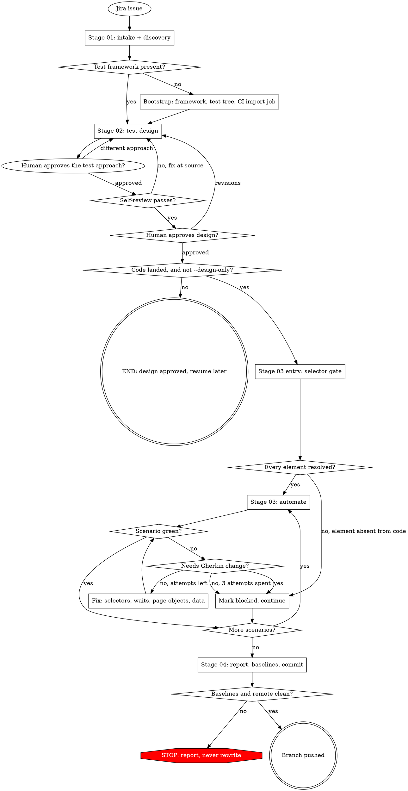

# Speckit QA Auto — Jira-to-Tests QA Pipeline

**Version**: 0.6.0
**Author**: Alex Nguyen

## Overview

Speckit QA Auto runs a complete QA delivery pipeline from a single Jira issue: it discovers what
already exists, reads the story, designs BDD test scenarios, verifies every UI selector against real
evidence, generates Playwright-BDD automation, runs it through a bounded run-and-fix loop, and
finishes with a human review and a pushed branch. Six properties matter most for anyone reading its
output:

1. **The Gherkin `.feature` file is the single artifact.** It is the manual tester's test case,
   the spec `playwright-bdd` compiles into automation, and the Cucumber Test Xray imports on
   merge — nothing is authored twice.
2. **`docs/qa/<jira-key>-<slug>/` is the source of truth.** The `.feature` file(s) there are
   authored and approved at Stage 02. The project's test tree (for example `src/tests/…`) holds
   only a **derived, scenario-level subset**, materialized by Stage 03 and never edited directly.
3. **Discovery runs before design.** Linked issues, existing Xray tests (Cucumber *and* Manual), and
   the repository's own `.feature` files are swept first, so a scenario is never designed in
   ignorance of coverage that already exists. Related stories are found along five axes, not just
   Jira links, because a link only finds what somebody took the trouble to create.
4. **Design can complete before the code does.** Writing test cases ahead of implementation is
   normal practice, so it is a supported path, not a workaround: the selector gate runs at the head
   of Stage 03, and a pre-code run finishes design, gets approved, and resumes into automation once
   the feature lands.
5. **The Stage 03 fix loop may not edit Gherkin.** It may fix selectors, waits, page objects,
   step definitions, test data, and mocks. A scenario that needs a different assertion or step is
   marked `blocked: needs-design-change`, never bent to pass.
6. **Xray import happens in CI, on merge — not inside this skill.** The pipeline never writes to
   Xray; a CI job reads `docs/qa/` (the complete approved set, automated, blocked, and manual
   scenarios alike) and imports it after the branch merges. Bootstrap writes that job for
   repositories that do not have one.

## Quick Start

```bash
skill speckit-qa-auto --issue https://jira.example.com/browse/MOM-1234
```

On GitHub Copilot / Claude Code, invoke as `/speckit-qa-auto --issue <jira-url-or-key>`; on
OpenCode, embed the flags in the trigger message. `--issue` is required on every invocation.

It accepts three kinds of key:

| Anchor | Produces |
|---|---|
| A **story** | One `.feature` set for that requirement |
| An **epic** | One `.feature` per child issue, each tagged with the child's key |
| An existing **Xray test** | Scenarios converted from that test, tagged with the requirement it links to |

One argument, three resolutions — never a second entry flag. The Jira key is the artifact folder's
identity, the `@REQ_` tag, the dedup key, and the resume glob; a second way in would mean a second
identity for all four.

### Where the run works

By default the run cuts a branch — `test/<jira-key>-<slug>` — **in the source checkout you are
already standing in**, off the base branch (`develop → main → master`). That is where a developer
expects a branch to be, and it costs no second checkout and no second dependency install.

`--parallel-worktree` puts the same branch in a linked worktree at `.worktrees/<branch>` instead.
Use it for the two cases the default cannot serve: more than one run against the same repository at
once, and a working tree too dirty for git to switch branches. If git refuses the switch, the run
stops and names the flag rather than stashing or committing your work to get past it.

The safety property differs, and the skill says so rather than implying otherwise. In worktree mode
Stage 04 verifies your checkout came out byte-identical. In branch mode it cannot — the pipeline is
writing there on purpose — so it verifies two narrower things instead: the run staged and wrote only
inside the paths it owns (`docs/qa/…` and the test tree), and every file you already had modified
still hashes to what it did at intake. `git add -A` is forbidden in branch mode for that reason.

## Pipeline Flow

Gates and loops only — the steps inside each stage are numbered lists in the pipeline reference
files, not diagrams.



Stage 03's automation region is the only part with no human edge: once the entry selector gate has
passed, it runs to a scenario verdict or to the circuit breaker. Every loop inside it is bounded —
3 fix attempts per scenario, 5 identical failures overall.

## Features

- **Discovery before design** — three concurrent sweeps (Jira linkage, Xray tests, repository
  tests) gather evidence, never verdicts, so dedup stays a mechanical rule rather than a subagent's
  opinion. Related stories are swept along five axes — links, shared component, epic siblings, a
  bounded text search, and whatever `--related` declares — each candidate recording which axis found
  it. Stage 01 records keys and summaries only; a human picks which are worth reading at the
  approach gate, so wider reach does not become more reading.
- **Gates written for the reader, not the machine** — one file owns everything a person sees: one
  question per message, as many questions as there are concerns, alternatives carried by the choices
  offered, and no step number, field name, or internal label quoted at a reader. It degrades to
  prose on a host with no structured question tool.
- **Test case priority** — every scenario carries one, derived from the ticket's own Jira priority
  and stepped down for negative, boundary, and edge cases, then settled by a human at the design
  gate. It rides the feature file as `@Priority_<Level>`, so it reaches Xray through the import CI
  already runs and `--tags @Priority_Highest` selects a smoke subset on day one.
- **Impact analysis** — a fourth sweep, sequenced after those three, traces every write against the
  story's entity back to the flow that owns it, and lists the existing tests on the same surface.
  A story that attaches an invoice to a work order candidate creates an invariant for every flow
  that already writes candidates, and none of those flows' tickets say so. The sweep returns
  candidates with evidence paths; a human decides at the gate, and cannot decline to answer.
- **Test approach agreed before any Gherkin exists** — after dedup and before a single scenario is
  written, the run states the depth it classified the story at and why, asks the questions whose
  answers change the design one at a time, and puts 2-3 approaches with their trade-offs in front of
  a human. Rejected alternatives are kept with their reasons. Disagreeing here costs a sentence;
  disagreeing at the design gate costs a redesign and a re-review.
- **Existing tests triaged by their description first** — every Xray test is reported with its
  `Test Objective:` line in `existing-tests-index.md`, so the design stage knows which manual step
  tables are worth reading closely. The index orders attention and never filters what dedup matches
  against, so two runs over an unchanged Xray still produce identical labels.
- **A paste-ready description for every test set** — `test-design.md` §0b carries a `Test Objective:`
  paragraph plus a scenario list derived from the `.feature` file, in the format a Jira or Xray
  Description field expects.
- **Adversarial design review** — before the design gate, a reviewer attacks the design with three
  questions scoped by the **ticket** rather than by the design's own list of criteria: which
  sentences state a rule that no scenario covers, what invariants this story creates for existing
  flows, and which lines were classified by the heading above them rather than by what they say.
  Self-review cannot find what its own question excludes; that is why this pass exists and why it
  is never skipped.
- **Requirement analysis and Xray dedup** — Stage 02 labels every behaviour `NEW`, `UPDATE`,
  `SKIP`, or `REVIEW` against a normalized scenario key, never a similarity judgement.
- **Manual test conversion** — existing Manual test cases become Gherkin scenarios imported as
  **new** Cucumber tests linked to the originals, never as overwrites; every deviation from the
  original is itemized at the gate.
- **Selector gate bound to evidence, not technique** — at the head of Stage 03, every `surface: ui`
  scenario resolves its elements against repository source, a live-DOM read (dispatched to a
  subagent), or a recorded semantic-fallback risk, chosen by the user at the gate.
- **Pre-code design** — `code_state: pending` finishes and approves a design with no frontend to
  read, records `selector_evidence: deferred` (which is *not* `fallback`), and resumes into
  automation when the feature lands.
- **Bootstrap for repositories with no test framework** — Playwright-BDD, the test tree, a base page,
  a worked example, the conventions playbook, and the Xray import CI workflow.
- **Playwright-BDD generation** — step definitions, page objects, selectors, and test data, per
  the discovered repo profile's conventions.
- **Bounded fix loop** — up to 3 fix attempts per scenario and a 5-failure circuit breaker;
  environmental failures stop the run instead of burning attempts.
- **Three human gates, and no flag skips them** — approach approval (Stage 02, step 2.2b), design
  approval (Stage 02, step 2.8), and commit/push approval (Stage 04), plus the self-review and
  selector gates. `design_depth` scales how many alternatives a gate presents; it never decides
  whether an answer is taken, never caps how many questions are asked, and is never shown to a
  reader — it drives knobs nobody can see.
- **Branch by default, worktree on request** — `--parallel-worktree` opts into an isolated
  worktree; the default cuts the branch in the checkout you are already in.
- **Content-aware workspace guard** — two integrity baselines (source checkout and frontend
  submodule) verified before any commit; a violation stops the run, never reverted automatically.
  In branch mode the checkout-level check becomes a scoped pair — nothing written outside the run's
  own paths, nothing already-dirty overwritten — because the whole-tree form would flag the run's
  own output.
- **Portable across three hosts** — GitHub Copilot, Claude Code, and OpenCode; subagent dispatch
  degrades to inline execution where the host offers none.

## Installation

Copy the `speckit-qa-auto` folder — together with `jira-to-speckit`, its only sub-skill
dependency — into the host's skill directory. The skill is auto-discovered from that location.

## Compatibility

| Host | Discovery directory |
|---|---|
| GitHub Copilot | `~/.agents/skills/`, `.github/skills/` |
| Claude Code | `~/.claude/skills/` |
| OpenCode | `~/.config/opencode/skills/` |

Requires `git`, `bash`, and a TypeScript repository, plus network access for Jira and, optionally,
Xray. A Playwright-BDD test tree is used when present and created by bootstrap when absent. At most
one frontend submodule is assumed.

## Examples

```bash
# Default: discovery, approach gate, design, selector gate, automation, all three human gates
skill speckit-qa-auto --issue MOM-1234

# Approved Gherkin now, automation later — the run stops after the design gate
skill speckit-qa-auto --issue MOM-1234 --design-only

# Whole epic: one .feature per child issue, one design gate for the batch
skill speckit-qa-auto --issue MOM-100

# Convert an existing Manual Xray test into automation
skill speckit-qa-auto --issue MOM-5678

# Name related stories up front instead of waiting for the sweep to guess them
skill speckit-qa-auto --issue MOM-1234 --related MOM-1200,MOM-1211

# Run the full suite instead of the default affected-domain scope
skill speckit-qa-auto --issue MOM-1234 --full-suite

# Also open the pull request after pushing, from the printed title and body
# (without --pr the run prints that text and leaves opening the PR to a human)
skill speckit-qa-auto --issue MOM-1234 --pr

# Work in an isolated worktree instead of the current checkout —
# for parallel runs, or a tree too dirty to switch branches
skill speckit-qa-auto --issue MOM-1234 --parallel-worktree
```

## Configuration

`.env` in the repository root:

| Variable | Required | Purpose |
|---|---|---|
| `JIRA_URL`, `JIRA_USERNAME`, `JIRA_API_TOKEN` | yes | Jira intake and discovery (Stage 01) |
| `XRAY_CLIENT_ID`, `XRAY_CLIENT_SECRET` | no | Existing-test sweep at Stage 01; absence degrades to a warning |

None of these are ever printed. Repo-specific conventions (test paths, run commands, the
selector attribute, the Xray project key) are discovered, not configured — see
`references/shared/repo-profile.md`. Only answers no discovered source can supply are cached, in
`docs/qa/.repo-profile.json`, alongside a provenance hash per source so a changed playbook is
never applied silently.

The Xray import CI job needs `XRAY_CLIENT_ID`, `XRAY_CLIENT_SECRET`, and `XRAY_PROJECT_KEY` as
repository secrets. Bootstrap writes the workflow but cannot set them, and says so.

## Troubleshooting

| Symptom | Fix |
|---|---|
| Run stops asking for `--issue` | Required on every invocation; pass a story, epic, or Xray test key |
| Xray sweep reports unavailable | Add `XRAY_CLIENT_ID` / `XRAY_CLIENT_SECRET`; the run continues with dedup `not-run` |
| Run ends after Stage 02 with `resume_from: 02.4` | The feature's code has not landed. Design is approved and committed; re-run once it has |
| Bootstrap asks to create files | The repository has no Playwright-BDD test tree. Approve the listed paths, or stop and point the run at a repository that has one |
| Xray import CI job fails | Its three secrets are not set by bootstrap; set them in repository settings |
| Selector gate has no evidence source to offer | Frontend source unreadable and no reachable app/browser automation; accept the fallback risk or fix the checkout |
| A scenario is blocked at the selector gate | The element is not in the built feature — design and implementation disagree. Resolve at design, not by substituting a fallback selector |
| Stage 02 self-review fails the same check 3 times | Stops by design — fix the scenario, intent map, or design at its source |
| Stage 01 stops: git refuses to switch branches | Local changes conflict with the base branch. Commit or stash them yourself, or re-run with `--parallel-worktree` — the run will not touch your working tree to clear its own way |
| Stage 04 reports a baseline violation | Something changed outside what the run owns — the frontend submodule, or (branch mode) a file you already had open, or a path outside `docs/qa/` and the test tree. Never reverted — resolve manually, re-run |
| Stage 04 push stops on a diverged remote | Fast-forward only, by design; rebase or merge manually, then re-run Stage 04 |
