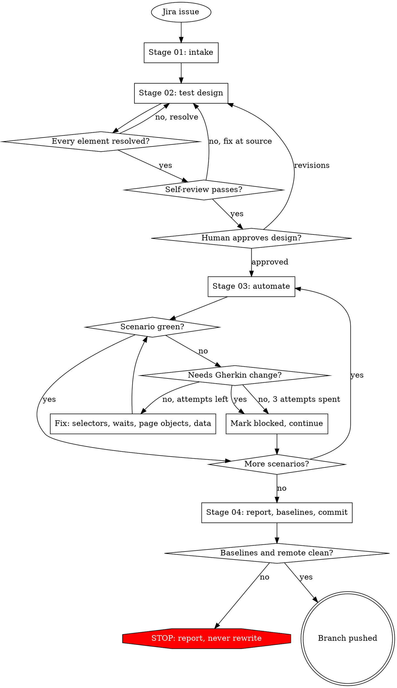

# Speckit QA Auto — Jira-to-Tests QA Pipeline

**Version**: 0.1.0
**Author**: Alex Nguyen

## Overview

Speckit QA Auto runs a complete QA delivery pipeline from a single Jira issue: it reads the
story, designs BDD test scenarios, verifies every UI selector against real evidence, generates
Playwright-BDD automation, runs it through a bounded run-and-fix loop, and finishes with a human
review and a pushed branch. Four properties matter most for anyone reading its output:

1. **The Gherkin `.feature` file is the single artifact.** It is the manual tester's test case,
   the spec `playwright-bdd` compiles into automation, and the Cucumber Test Xray imports on
   merge — nothing is authored twice.
2. **`docs/qa/<jira-key>-<slug>/` is the source of truth.** The `.feature` file(s) there are
   authored and approved at Stage 02. The project's test tree (for example `src/tests/…`) holds
   only a **derived, scenario-level subset**, materialized by Stage 03 and never edited directly.
3. **The Stage 03 fix loop may not edit Gherkin.** It may fix selectors, waits, page objects,
   step definitions, test data, and mocks. A scenario that needs a different assertion or step is
   marked `blocked: needs-design-change`, never bent to pass.
4. **Xray import happens in CI, on merge — not inside this skill.** The pipeline never writes to
   Xray; a CI job reads `docs/qa/` (the complete approved set, automated, blocked, and manual
   scenarios alike) and imports it after the branch merges.

## Quick Start

```bash
skill speckit-qa-auto --issue https://jira.example.com/browse/MOM-1234
```

On GitHub Copilot / Claude Code, invoke as `/speckit-qa-auto --issue <jira-url-or-key>`; on
OpenCode, embed the flags in the trigger message. `--issue` is required on every invocation — the
Jira key is the artifact folder's identity, the `@REQ_` tag on every scenario, and the dedup key
against existing Xray coverage.

## Pipeline Flow

Gates and loops only — the steps inside each stage are numbered lists in the pipeline reference
files, not diagrams.



Stage 03 is the only region with no human edge: once entered, it runs to a scenario verdict or to
the circuit breaker. Every loop inside it is bounded — 3 fix attempts per scenario, 5 identical
failures overall.

## Features

- **Requirement analysis and Xray dedup** — Stage 02 labels every behaviour `NEW`, `UPDATE`,
  `SKIP`, or `REVIEW` against a normalized scenario key, never a similarity judgement.
- **Selector gate bound to evidence, not technique** — every `surface: ui` scenario resolves its
  elements against repository source, a live-DOM read (dispatched to a subagent), or a recorded
  semantic-fallback risk, chosen by the user at the gate.
- **Playwright-BDD generation** — step definitions, page objects, selectors, and test data, per
  the discovered repo profile's conventions.
- **Bounded fix loop** — up to 3 fix attempts per scenario and a 5-failure circuit breaker;
  environmental failures stop the run instead of burning attempts.
- **Two human gates** — design approval (Stage 02) and commit/push approval (Stage 04) in default
  mode; both skip under `--yolo`, but the selector and self-review gates never do.
- **Content-aware workspace guard** — two integrity baselines (source checkout and frontend
  submodule) verified before any commit; a violation stops the run, never reverted automatically.
- **Portable across three hosts** — GitHub Copilot, Claude Code, and OpenCode.

## Installation

Copy the `speckit-qa-auto` folder — together with `jira-to-speckit`, its only sub-skill
dependency — into the host's skill directory. The skill is auto-discovered from that location.

## Compatibility

| Host | Discovery directory |
|---|---|
| GitHub Copilot | `~/.agents/skills/`, `.github/skills/` |
| Claude Code | `~/.claude/skills/` |
| OpenCode | `~/.config/opencode/skills/` |

Requires `git`, `bash`, and a Playwright-BDD + TypeScript test repository, plus network access for
Jira and, optionally, Xray. At most one frontend submodule is assumed.

## Examples

```bash
# Default mode: human gates at design and finish
skill speckit-qa-auto --issue MOM-1234

# Autonomous: skips both approvals, never the selector or self-review gates
skill speckit-qa-auto --yolo --issue https://jira.example.com/browse/MOM-1234

# Run the full suite instead of the default affected-domain scope
skill speckit-qa-auto --issue MOM-1234 --full-suite

# Print PR title/body and leave opening the PR to a flag-driven step
skill speckit-qa-auto --issue MOM-1234 --pr
```

## Configuration

`.env` in the repository root:

| Variable | Required | Purpose |
|---|---|---|
| `JIRA_URL`, `JIRA_USERNAME`, `JIRA_API_TOKEN` | yes | Jira intake (Stage 01) |
| `XRAY_CLIENT_ID`, `XRAY_CLIENT_SECRET` | no | Existing-test read at Stage 01; absence degrades to a warning |

None of these are ever printed. Repo-specific conventions (test paths, run commands, the
selector attribute, the Xray project key) are discovered, not configured — see
`references/shared/repo-profile.md`. Only answers no discovered source can supply are cached, in
`docs/qa/.repo-profile.json`, alongside a provenance hash per source so a changed playbook is
never applied silently.

## Troubleshooting

| Symptom | Fix |
|---|---|
| Run stops asking for `--issue` | Required on every invocation; pass a Jira key or browse URL |
| Xray read reports `xray: unavailable` | Add `XRAY_CLIENT_ID` / `XRAY_CLIENT_SECRET`; the run continues with dedup `not-run` |
| Selector gate has no evidence source to offer | Frontend source unreadable and no reachable app/browser automation; accept the fallback risk or fix the checkout |
| Stage 02 self-review fails the same check 3 times | Stops by design — fix the scenario, selector map, or design at its source |
| Stage 04 reports a baseline violation | Checkout or frontend submodule changed outside the run; never reverted — resolve manually, re-run |
| Stage 04 push stops on a diverged remote | Fast-forward only, by design; rebase or merge manually, then re-run Stage 04 |
