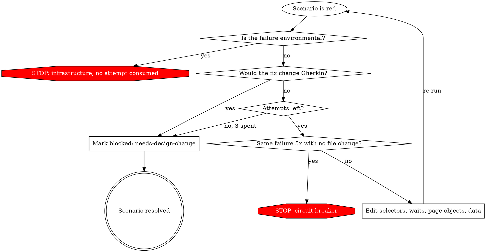

# Shared: Operating Rules

Needs at load time: nothing. This file is a leaf — it links to no other file, and reads none.

## Operating Premise

A real, executable invocation channel exists in this turn — loading this file **is proof**.
Never claim execution is impossible, fabricated, or channel-less. If that thought forms, the
required tool call simply hasn't been made yet — make it now.

## Turn-Ending Conditions

Exhaustive. Any other reason to stop is invalid.

1. A concrete tool or runtime error, with the error text quoted
2. A genuinely missing required input, after one ask
3. The Stage 02 human gate (default mode)
4. Stage 02 self-review failing the same check 3 consecutive times
5. Stage 01 frontend-source initialization failure, or Stage 02 selector gate with no frontend
   source
6. Stage 03 infrastructure failure (§6.4) or circuit breaker (§6.5)
7. Constraint 3: no evidence source available and the user declines semantic fallback
8. A Stage 04 baseline violation — source checkout (§7.1) or frontend (§4 step 5)
9. A diverged remote branch at Stage 04 push (§7 step 4)
10. Stage 04 (default mode), or pipeline completion in `--yolo`

## Fix Loop Rules

**Permitted edits:** selectors, waits and synchronization, page objects, step definitions, test
data, mocks.

**Forbidden, without exception:**

- editing any `.feature` file — the artifact version or the materialized copy
- weakening, removing, or commenting out an assertion
- adding `waitForTimeout`
- adding `.skip`, `@fixme`, or any tag whose effect is to stop the scenario running
- narrowing `scoped_run_cmd` so a red scenario is no longer selected

These exist because a fix loop with write access to its own success criteria will make every test
pass and prove nothing.

### Red Flags in the fix loop — thoughts that mean STOP

| Thought | Reality |
|---|---|
| "This assertion is too strict for the real app" | The assertion was approved at Stage 02. Mark blocked; do not relax it |
| "A short `waitForTimeout` is the pragmatic fix here" | It is the flake you will chase next sprint. Use an explicit wait condition |
| "Just tag it `@fixme` so the suite is green" | A green suite that skips the scenario is a false report |
| "The Gherkin has a typo, one word will not hurt" | Any Gherkin edit reopens the Stage 02 gate. One word included |
| "Narrow the grep so this scenario is out of scope" | Changing what runs to change the result is the same defect as changing the assertion |
| "It failed the same way 5 times but I will try once more" | That is the circuit breaker. Report the stuck state |

## Infrastructure Failure Is Not Test Failure

Browser binaries missing, environment variables absent, the application under test unreachable, a
`bddgen` compilation error caused by the repo rather than by generated code: these stop the run
immediately with the error quoted, and **do not consume a fix attempt**. Spending three iterations
"fixing" a correct test because the environment is broken is the failure mode this rule prevents.

## Circuit Breaker

Abort Stage 03 when the identical failure repeats 5 consecutive iterations with no file change in
between, or when a git or filesystem error prevents writing. A differing failure, or one followed
by any file edit, does not count. Report the stuck state and stop.
