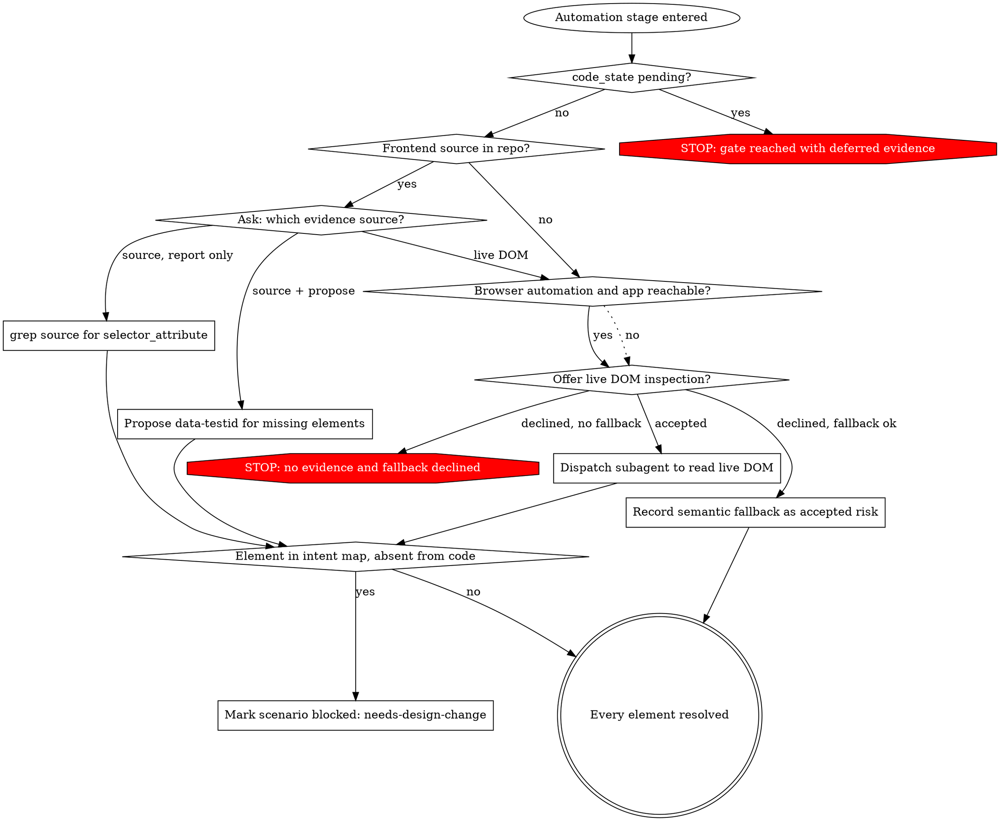

# Shared: Selector Verification

Needs at load time: nothing. This file is a leaf — it links to no other file, and reads none.

## Overview

Guessed selectors are the dominant cause of red tests, and every red test costs a fix iteration
downstream. The selector gate exists to stop a guess from reaching automation.

**The gate runs at the head of the automation stage, not inside the design stage.** It is the last
thing checked before any code is generated and the first thing checked after the design is
approved. Nothing enters automation with an unresolved element — the protection is unchanged from
when this gate sat one stage earlier.

What moved, and why it had to: a test case is very often written before the feature is built.
Design happens against acceptance criteria; the code lands weeks later. With the gate inside the
design stage, that ordinary workflow had exactly one way through — declaring a semantic fallback
and accepting a risk — which recorded "we searched and had to guess" for a run where there was
nothing to search yet. The gate belongs where the thing it protects lives, and the thing it protects
is automation.

## Two Artifacts, Two Stages

| Stage | Artifact | Written in the language of |
|---|---|---|
| Design | **Element intent map** | The product: "the Reset button in the agreement header" |
| Automation entry | **Selector map** | The DOM: `[data-testid="agreement-reset"]`, with evidence |

The design stage names *what the scenario touches*. The automation stage resolves *how to address
it*. A design reviewer can check the first without reading the frontend; only the second needs the
code to exist.

The intent map is not a weaker selector map. Every `surface: ui` scenario must name every element
it touches, and design self-review fails on a missing one exactly as it always did. What it no
longer requires is that the element already exist in code.

## `selector_evidence`

Four values, and the fourth is the one that keeps the other three meaningful:

| Value | Means |
|---|---|
| `source` | Resolved by reading the frontend repository |
| `live-dom` | Resolved by reading the running application |
| `fallback` | Evidence was sought, none was conclusive, a semantic strategy was accepted as a recorded risk |
| `deferred` | The code has not landed. There was nothing to seek |

## Deferred Is Not Fallback

`fallback` is a risk that was searched for and accepted. `deferred` is the absence of anything to
search. Recording pre-code work as `fallback` would mark every test-case-before-code run as risky,
and the Stage 04 report — which repeats `selector_evidence` precisely so a human sees the risky
runs — would fill with runs carrying no selector risk whatsoever. The signal would survive in form
and die in use.

This is the same distinction the dedup rule draws between `not-run` and "ran, found nothing", and
it exists for the same reason: an unperformed check must never be indistinguishable from a
performed one.

`deferred` is written by the design stage when `run.code_state` is `pending`, and it is not a
terminal value. The run ends after design with `resume_from` naming this gate. When the code lands
and the run resumes, this gate runs for real and `selector_evidence` becomes one of the other
three. A run that reaches automation still carrying `deferred` has skipped the gate.

## The Three Evidence Sources

| Source | Available when | Produces |
|---|---|---|
| **Repository source** | `frontend_source_root` resolves to a readable tree | `grep` for `selector_attribute`; existing testid, or a proposed one with file and line |
| **Live DOM** | The host exposes browser automation **and** the app is reachable | Real attributes read from the running application, in a subagent |
| **Semantic fallback** | Always | `role` / label / text strategy, recorded as an accepted risk |

## `selector_resolution`

## The Gate Runs Before The No-Stop Zone Opens

The automation stage asks no questions once it is running. This gate asks one — which evidence
source — and may stop. Both are true because the gate runs **before** the no-stop zone opens, not
inside it. The sequence at the head of that stage is: resolve the intent map into a selector map,
then open the no-stop zone, then generate and verify.

Putting the question here rather than mid-run is what keeps it answerable. Asking "which evidence
source?" after three scenarios have already been generated against the wrong one is not a question,
it is a rollback.

## An Element That Does Not Exist Is A Design Verdict, Not A Stop

When the design was approved before the code was written, the code may not match it. An element in
the intent map that resolves against nothing real is that mismatch surfacing — the feature was
built differently from the acceptance criteria the design read.

That scenario is marked `blocked: needs-design-change` and the run continues with the rest. It is
not a stop, and it is not a fallback: there is no risk to accept, because there is no element. It
is also not a fix-loop failure — it is known before the first attempt is spent, and the fix-loop
budget is never charged for it.

The distinction that matters: **fallback means the element exists and addressing it is a guess;
blocked means the element is not there at all.**

## The Choice Is Asked, Never Assumed

When frontend source is present, the user still picks one of: report-only, propose-testids, or go
to the live DOM anyway. A stale checkout makes source the wrong evidence, and only the user knows
that — the pipeline has no way to tell a current checkout from a stale one by reading it.

## Live DOM Runs In A Subagent

The subagent receives the element list and the application URL, drives the host's browser
automation, and returns **only the selector map**. A full DOM dump is large, single-use, and would
crowd the automation context for no benefit.

It reads. It never submits forms, mutates data, or triggers modal dialogs.

**Prerequisites:** a base URL, and credentials when the app requires them. Missing either means
**the option is not offered** — a login wall returns a selector map for the login page and
nothing else, which is not evidence for the scenario that needed it.

## Semantic Fallback Is A Recorded Risk

Choosing it writes `selector_evidence: fallback` into `test-design.md`, plus the user's
acknowledgement. The Stage 04 report repeats it. Fallback-derived selectors are the strategy most
likely to consume fix iterations; saying so up front is the point of recording it, not an
afterthought.

## Frontend Edits

Report-only by default: proposed `data-testid` additions are named with file and line, never
applied. Explicit approval sets `frontend_edits_approved: true`, and the edits then land on a
**separate frontend branch inside the submodule** — never on the test branch, and never mixed into
the same commit as test artifacts.

A repository whose application was written without testability in mind produces a great many of
these proposals at once. That volume is a finding, not a blocker: report it, and let the team decide
whether to take the frontend work on before automating, or to fall back for now and accept the
recorded risk. The pipeline does not make that call.

## The Two Map Shapes

**Element intent map** — written by the design stage, one table per `surface: ui` scenario:

| Element | Where it appears | What the scenario does with it |
|---|---|---|

**Selector map** — written by this gate, one table per scenario:

| Element | Evidence | Strategy |
|---|---|---|

Every selector-map row resolves to exactly one of:

- an existing selector (source or live DOM), quoted as found
- a proposed selector, with the file and line where it would be added
- a semantic fallback, with the `role` / label / text strategy named

A row with none of the three is not a resolved element, and its scenario does not enter automation.

## Red Flags — thoughts that produce a guessed selector

| Thought | Reality |
|---|---|
| "The testid probably exists under the usual name" | That is a guess. The gate exists to stop exactly this — grep for it or read the live DOM; do not assume a naming convention held |
| "I'll write a CSS path off the screenshot" | A screenshot is not evidence. It is a snapshot of one render, and a CSS path derived from it breaks on the next markup change |
| "No frontend checkout, so I'll skip the gate" | The gate does not skip. No frontend source means offer live DOM inspection, or fall to a recorded semantic fallback — never silence |
| "It's obviously a button, `role: button` is close enough without asking" | Semantic fallback is still a choice, not a default. Record it and get the acknowledgement, or use one of the other two sources |
| "The code isn't written yet, I'll record a fallback so the run can continue" | That is what `deferred` is for. `fallback` means evidence was sought; recording it for a run with nothing to seek drains the meaning out of the one value that flags real risk |
| "The gate is at the automation stage now, so design can leave elements vague" | The intent map is required in full at design. What moved is when elements resolve to selectors, not whether the scenario has to say what it touches |
| "This element isn't in the code, I'll fall back to a role selector" | A fallback addresses an element that exists. An element that is not there is `blocked: needs-design-change` — the design and the built feature disagree, and a role selector would hide that |
| "The map has one unresolved row, I'll generate the rest of the scenario" | One unresolved element keeps its scenario out of automation. Resolve it, record a fallback with acknowledgement, or block the scenario — there is no fourth exit |
