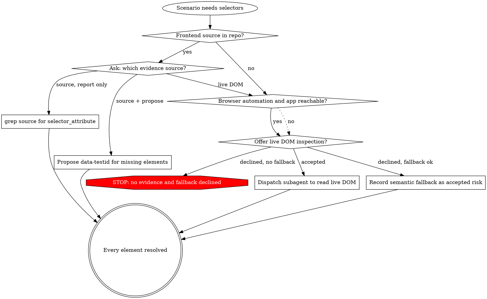

# Shared: Selector Verification

Needs at load time: nothing. This file is a leaf — it links to no other file, and reads none.

## Overview

Guessed selectors are the dominant cause of red tests, and every red test costs a fix iteration
downstream. This is why the selector gate exists on Stage 02: every element of every `surface: ui`
scenario must resolve against something real before its Gherkin is approved.

**The gate binds to evidence, not to a technique.** Repository source is one way to obtain
evidence. A live DOM read is another. A semantic fallback is a third, and it is explicitly a
recorded risk rather than a free pass. Which one applies is a question put to the user — the same
shape as a design-section approval, never a silent branch the pipeline picks for itself.

The gate applies only to scenarios whose `surface` is `ui`. A scenario with `surface: api` names
its endpoint and fixture instead; a scenario with `surface: manual` carries a one-line reason. Zero
elements on a `surface: ui` scenario is a design error, not a pass.

## The Three Evidence Sources

| Source | Available when | Produces |
|---|---|---|
| **Repository source** | `frontend_source_root` resolves to a readable tree | `grep` for `selector_attribute`; existing testid, or a proposed one with file and line |
| **Live DOM** | The host exposes browser automation **and** the app is reachable | Real attributes read from the running application, in a subagent |
| **Semantic fallback** | Always | `role` / label / text strategy, recorded as an accepted risk |

## `selector_resolution`

## The Choice Is Asked, Never Assumed

When frontend source is present, the user still picks one of: report-only, propose-testids, or go
to the live DOM anyway. A stale checkout makes source the wrong evidence, and only the user knows
that — the pipeline has no way to tell a current checkout from a stale one by reading it.

## Live DOM Runs In A Subagent

The subagent receives the element list and the application URL, drives the host's browser
automation, and returns **only the selector map**. A full DOM dump is large, single-use, and would
crowd the design context for no benefit.

It reads. It never submits forms, mutates data, or triggers modal dialogs.

**Prerequisites:** a base URL, and credentials when the app requires them. Missing either means
**the option is not offered** — a login wall returns a selector map for the login page and
nothing else, which is not evidence for the scenario that needed it.

## Semantic Fallback Is A Recorded Risk

Choosing it writes `selector_evidence: fallback` into `test-design.md`, plus the user's
acknowledgement. The Stage 04 report repeats it. Fallback-derived selectors are the strategy most
likely to consume Stage 03 fix iterations; saying so up front is the point of recording it, not an
afterthought.

## `--yolo` Order

Fixed, and it never invents evidence: repository source if readable, else live DOM if available,
else **stop**. `--yolo` does not choose fallback on the user's behalf — fallback is an accepted
risk, and accepting a risk is a human act.

## Frontend Edits

Report-only by default: proposed `data-testid` additions are named with file and line, never
applied. Explicit approval sets `frontend_edits_approved: true`, and the edits then land on a
**separate frontend branch inside the submodule** — never on the test branch, and never mixed into
the same commit as test artifacts.

## The Selector Map Shape

One table per scenario:

| Element | Evidence | Strategy |
|---|---|---|

Every row resolves to exactly one of:

- an existing selector (source or live DOM), quoted as found
- a proposed selector, with the file and line where it would be added
- a semantic fallback, with the `role` / label / text strategy named

A row with none of the three is not a resolved element — the gate has not been satisfied for it.

## Red Flags — thoughts that produce a guessed selector

| Thought | Reality |
|---|---|
| "The testid probably exists under the usual name" | That is a guess. The gate exists to stop exactly this — grep for it or read the live DOM; do not assume a naming convention held |
| "I'll write a CSS path off the screenshot" | A screenshot is not evidence. It is a snapshot of one render, and a CSS path derived from it breaks on the next markup change |
| "No frontend checkout, so I'll skip the gate" | The gate does not skip. No frontend source means offer live DOM inspection, or fall to a recorded semantic fallback — never silence |
| "It's obviously a button, `role: button` is close enough without asking" | Semantic fallback is still a choice, not a default. Record it and get the acknowledgement, or use one of the other two sources |
| "The map has one unresolved row, I'll leave it and move on" | One unresolved element fails Stage 02 self-review. Resolve it or mark the scenario blocked at the design stage — do not carry it forward silently |
